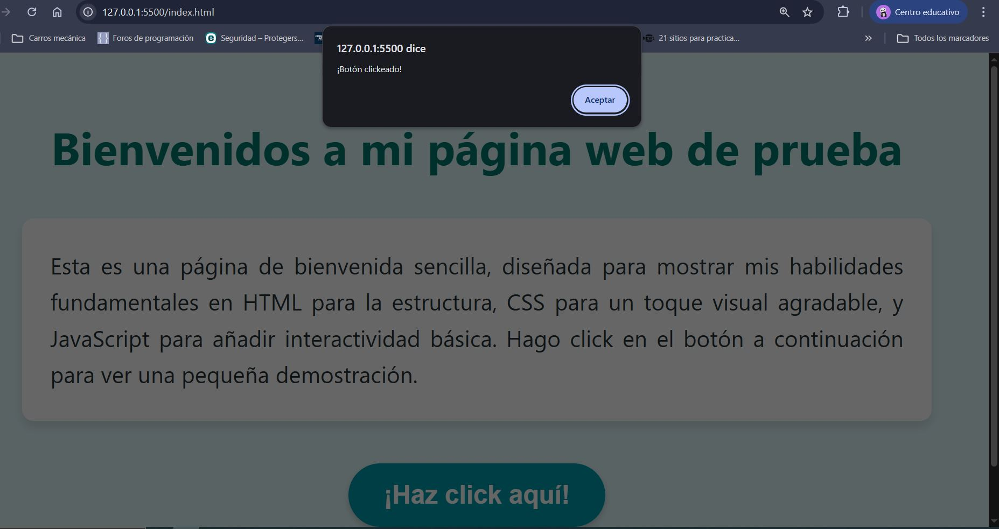
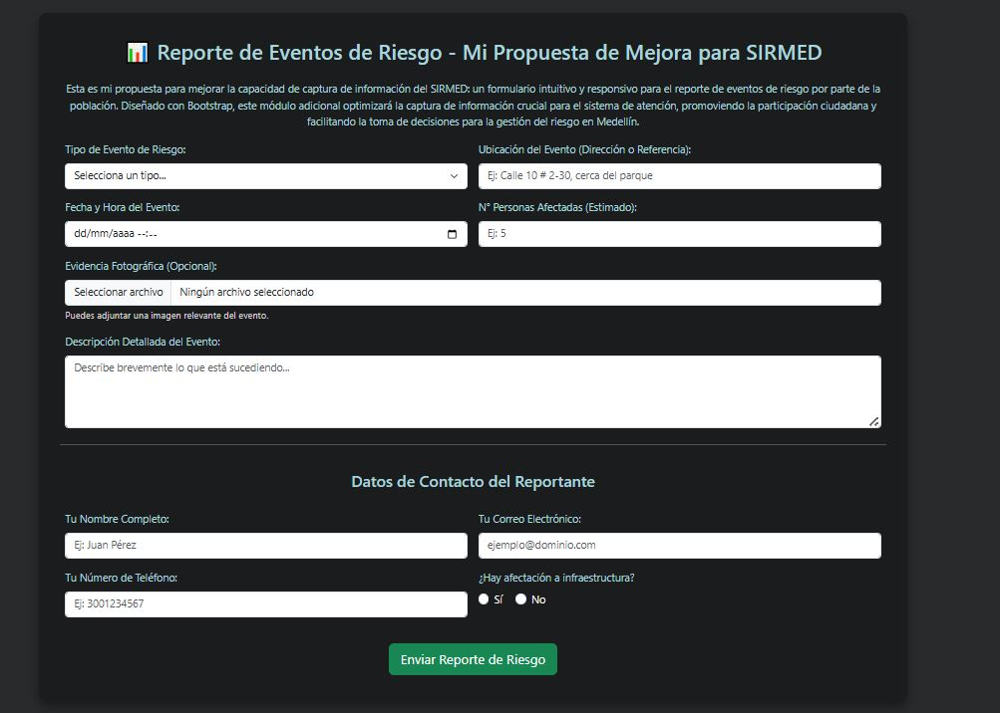
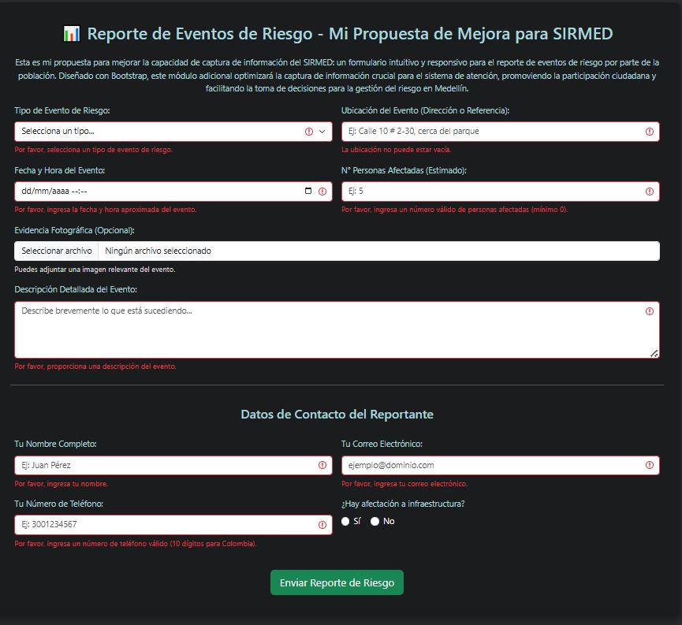

# 🚀 Desafío Técnico para Desarrollador FullStack: ¡Mi Propuesta Integral! 🚀

## ✨ Visión General del Reto

Este proyecto es la resolución detallada de un desafío técnico de desarrollo web, diseñado no solo para cumplir con los requisitos, sino para ir más allá, demostrando **iniciativa, pensamiento crítico y un dominio profundo** de las tecnologías clave. Mi objetivo es presentar una solución robusta y bien estructurada que refleje mi compromiso con la calidad y la excelencia.

---

## 🛠️ Tecnologías Utilizadas

* **HTML & CSS:** Estructura y diseño responsivo de la interfaz de usuario.
* **JavaScript:** Lógica interactiva en el frontend y validaciones de formularios.
* **Node.js:** Entorno de ejecución para el desarrollo del backend y microservicios.
* **Express.js:** Framework ágil y potente para construir APIs RESTful.
* **JBoss (WildFly):** Servidor de aplicaciones para el despliegue de una aplicación web (con enfoque en adaptabilidad).
* **Postman :** Permitirá comprobar los microervicios y APis. 

---

## 🎯 Componentes Clave del Proyecto

### 1. 🌐 Frontend Robusto con HTML y JavaScript

* **Página HTML Básica:** Una base sólida con encabezados, párrafos y un botón interactivo usando JavaScript para demostrar funcionalidad elemental.
* **Formulario Web Inteligente:** Implementación de un formulario con **validaciones exhaustivas** en JavaScript. Más allá de la validación de campos vacíos, se han contemplado **múltiples escenarios de error** (longitud, formato, etc.) y se han diseñado **mensajes de error claros y feedback visual** para una experiencia de usuario impecable. ¡Aquí aplicamos una mentalidad de desarrollador y tester!

### 2. ⚡ Backend con Node.js y Express.js (Aprendizaje Profundo)

* **API RESTful Funcional:** Creación de una API con Express.js que expone un `endpoint` `/greet` para un saludo JSON. Se prioriza el entendimiento de `APIs`, `endpoints` y la configuración de `rutas`.
* **Middleware de Registro Avanzado:** Implementación de un `middleware` para **registrar detalladamente cada solicitud** (método HTTP y URL) en la consola, mostrando cómo se interceptan y procesan las peticiones en el flujo del servidor.

### 3. 🧩 Microservicio Ágil de Agregación

* **Microservicio de Suma:** Desarrollo de un microservicio dedicado en Node.js, con un `endpoint` `/add` que recibe parámetros `a` y `b` y devuelve su suma en JSON. Se han aplicado **mejores prácticas de diseño, modularidad y manejo de errores** para garantizar una solución eficiente y escalable.
* **Pruebas Exhaustivas:** Verificación del microservicio con **Postman y cURL**, incluyendo **capturas de evidencia** de las respuestas y los códigos de estado HTTP, para asegurar su correcto funcionamiento y demostrar habilidades de testing de APIs.

### 4. ☁️ Aplicación Web en JBoss (Enfoque Estratégico)

* **Despliegue Básico en JBoss:** Implementación y despliegue de una aplicación web simple que muestra un mensaje "Hola desde JBoss". Se explorará la mejor estrategia para integrar este componente, asegurando la compatibilidad con el resto de las tecnologías y destacando la capacidad de adaptación a diferentes entornos.

---

## ✨ Mi Compromiso Adicional

Mi objetivo va más allá de cumplir los requisitos mínimos. Busco demostrar una **comprensión profunda de cada tecnología**, la capacidad de implementar **mejores prácticas de desarrollo**, y la habilidad para crear **soluciones que consideren la usabilidad y la robustez**. Este proyecto es una muestra de mi dedicación y mi entusiasmo por formar parte de su equipo.

* **Erika Alexandra  García Barrios**
* **Software Engineer Std 9 semestre**
* **I.U. Pascual Bravo**

* **EVIDENCIAS**

### 📸 Evidencia: Página HTML Básica

Aquí puedes ver la funcionalidad de mi página web básica, incluyendo la alerta al hacer clic en el botón.

### Captura del Formulario (Estado Normal)

### Captura del Formulario (Requisitos Mínimos)

